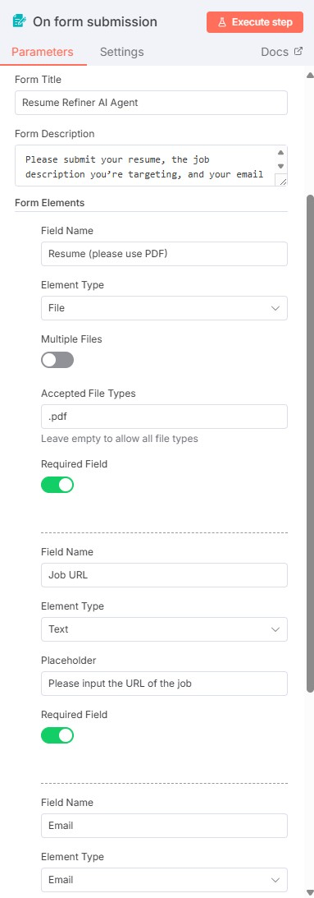

# 📄 Resume Refiner AI Agent

**An AI-powered resume enhancement tool built in n8n.**  
This agent takes user-uploaded resumes, scrapes job descriptions, and provides tailored improvement suggestions and keyword insights — all automatically delivered to your inbox.

---

## 🚀 Overview

The Resume Refiner AI Agent is a workflow designed in [n8n](https://n8n.io) that automatically:

- Parses resumes (PDF format only)
- Extracts job description content from online postings
- Sends structured, customized feedback via email

It utilizes OpenAI for semantic analysis and formatting, ensuring actionable results in JSON format with the help of a Structured Output Parser.

---

## 🧠 Building the Agent

### What approach did you take to design your agent?

I began by understanding the full data flow — from user input to output delivery. Then I mapped out each step in n8n and added logic and conditions as necessary to support automation and accuracy.

### What challenges did you face in parsing, formatting, or integration?

- The biggest challenge in parsing was retrieving content from job description pages that used dynamic JavaScript instead of static HTML.  
- Managing token length limits for input/output also proved tricky, especially with longer resumes or job descriptions.  
- Formatting was particularly challenging — making sure the AI output matched the structured format expected by the parser and Gmail.  
- The Structured Output Parser was crucial to ensuring reliable JSON output.

### How did you ensure that the AI returned JSON reliably?

I used the **Structured Output Parser** to enforce a consistent JSON structure from the AI model.

---

## 🛠️ Troubleshooting

### What issues did you encounter and how did you resolve them?

- **Dynamic Job Descriptions:** Some job postings did not include HTML content. I implemented fallback logic to scrape the content from the rendered page using JavaScript.
- **Inconsistent Formatting:** I had to carefully align formats between the AI Agent, the Output Parser, and the Gmail Message module to ensure consistent delivery.
- **Unsupported Resume Format:** Parsing `.docx` or `.txt` formats failed. I added a conditional check that prompts the user to upload a PDF resume only.

---

## 📈 Optimization

### What would you improve or add in future iterations?

- Optimize the input/output format to reduce token count — making it more compatible with lighter models like GPT-3.5.  
- Potential enhancements include multilingual support and tighter resume-job alignment scoring.

## 📸 Screenshots

### 🧠 Full n8n Workflow
> Visual overview of the complete automation process from form submission to email delivery.


---

### ⚙️ AI Agent Node Configuration
> Configuration of the AI Agent using OpenAI and Structured Output Parser to produce reliable JSON responses.


---

### 🧷 Trigger & Form Settings
> The trigger node and form setup including field validation for `.pdf` resumes.


---

### 📝 User Form Input
> Example of the form presented to users when submitting their resume and job link.


---

### 📬 Email Output Example
> The final email the user receives, containing actionable suggestions and keywords tailored to the job description.


---

### 💬 Prompt Expression View
> Expression panel showing how prompts are structured and interpreted by the AI Agent.


## 📨 Example Interaction

### Input (Form Submission):

```
Resume: John_Doe_Resume.pdf  
Job URL: https://company.com/job/software-engineer
```

### Output (Email):

```json
{
  "suggestions": [
    "Tailor your resume headline to match the job title.",
    "Add Python to your skill list based on job description."
  ],
  "keywords": [
    "REST APIs",
    "Agile",
    "CI/CD"
  ]
}
```

---

## 📂 Requirements

- [n8n](https://n8n.io) self-hosted or cloud instance  
- OpenAI API key  
- Gmail module access (for sending output)
